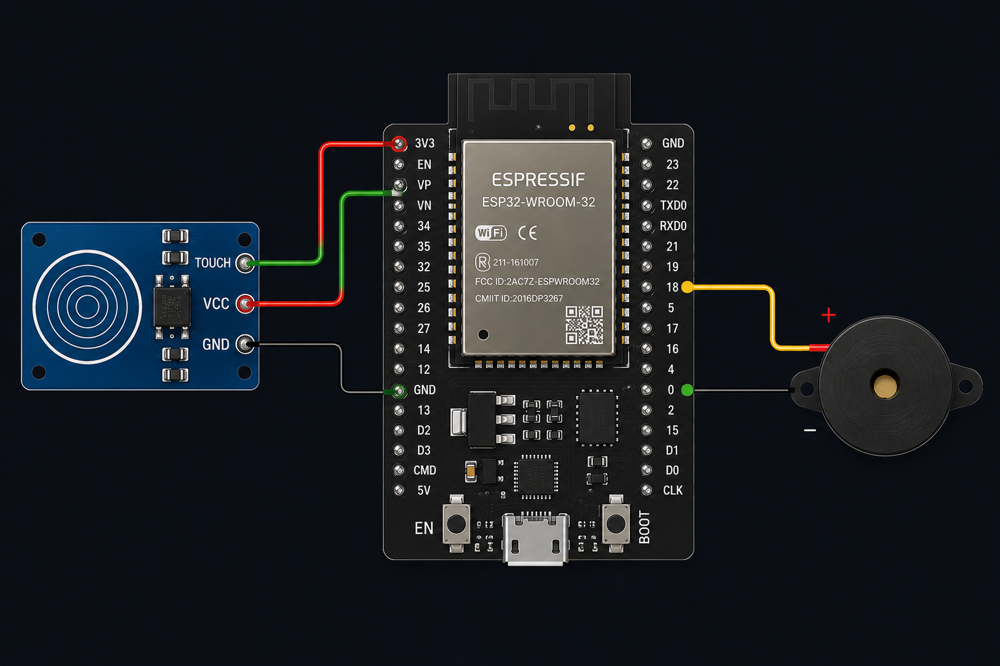
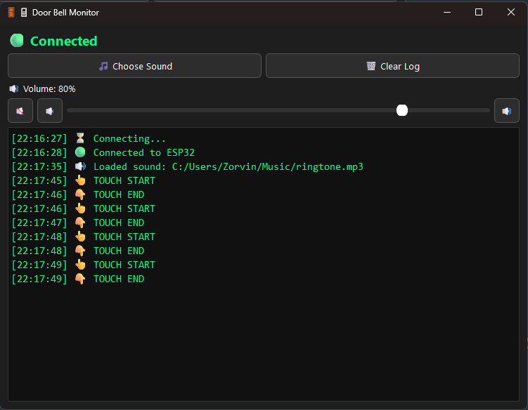
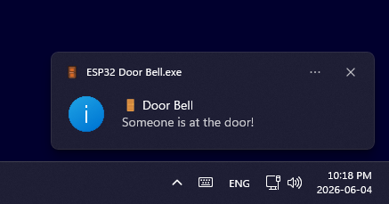
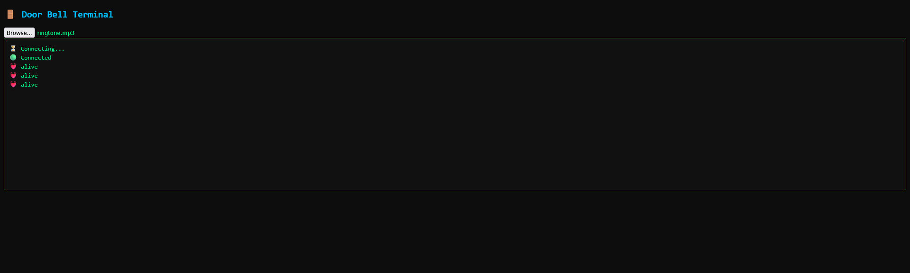

# ESP32 Smart Door Bell

A WiFi-enabled smart doorbell system built with ESP32 + WebSocket + Desktop Companion App.

This project turns a simple touch sensor into a real-time smart notification system that works across:
- Desktop app (Windows EXE)
- Web browser dashboard
- System tray background service

---

## Features

### ESP32 Firmware
- WiFi connection (2.4GHz)
- Touch sensor as door trigger
- Real-time WebSocket communication
- Sends down / up events instantly
- Auto reconnect support
- Low latency design

---

### Desktop App (Python + PyQt6)

- Real-time doorbell notifications
- Custom sound selection (MP3 / WAV / OGG)
- Volume control (slider + mute/min/max buttons)
- Auto reconnect WebSocket client
- Live log system (terminal style)
- Connection status indicator
- System tray support (like Discord)
  - Closing window hides app (not exit)
  - Runs in background
  - Tray menu: Open / Exit
- Windows notification popup
- Packaged as EXE (no terminal needed)

---

### Web Dashboard (ESP32)

ESP32 hosts a built-in web page:

- Live status updates via WebSocket
- Shows “Someone is at the door!”
- Plays sound in browser
- Browser notifications (if allowed)
- Works without desktop app

URL:
http://192.168.1.50/

Use case:
- Open in Chrome / Edge
- Keep tab open for lightweight monitoring

---

## How It Works

### 1. Touch Event
ESP32 detects touch:

down → doorbell pressed  
up → doorbell released  

---

### 2. WebSocket Communication

ESP32 sends real-time messages:

down → trigger started  
up → trigger ended  

No refresh needed.

---

### 3. Desktop App Behavior

When event received:
- Plays selected sound
- Shows notification
- Logs event with timestamp
- Runs in system tray

---

### 4. Web Browser Behavior

If page is open:
- Shows live status
- Plays sound
- Shows browser notification (if permitted)

---

## Hardware

| Component | Connection |
|----------|------------|
| Touch SIG | GPIO 4 |
| VCC | 3.3V |
| GND | GND |
| Buzzer + | GPIO 18 |
| Buzzer - | GND |

## Wiring Diagram

---
## Software Stack

### ESP32
- Arduino framework
- Async WebServer
- WebSocket server

### Desktop App
- Python 3.11+
- PyQt6
- websocket-client
- PyInstaller

---

## Desktop App Features

### Auto Reconnect
If connection drops:
- Automatically reconnects every 1 second

---

### System Tray Mode
- X button hides app
- App keeps running in background
- Tray icon shows status
- Double click → open window
- Right click → Exit

---

### Audio System
- Custom sound file support
- Instant playback
- Volume control
- Mute / Min / Max buttons

---

## Communication Flow

[Touch Sensor]
      ↓
    ESP32
      ↓
 WebSocket
      ↓
Desktop App + Browser
      ↓
Sound + Notifications

---

## Screenshots

Desktop App  

Tray Notification  

Web Dashboard  

---

## Future Improvements

- Save settings (sound, volume, IP)
- Multi-door support
- Offline detection (heartbeat)
- Mobile notifications (Telegram / Push)
- Auto start with Windows
- ESP32-CAM video integration

---

## Build EXE

pyinstaller --onefile --windowed --name "your desired file name" --icon assets/icon.ico --add-data "assets;assets" doorbell.py

---

## Notes

- Works only on WiFi 2.4GHz
- Recommended stable USB power

---

## Project Type

IoT + Desktop + Web hybrid system:
- Embedded (ESP32)
- WebSocket realtime communication
- Desktop GUI app
- Web dashboard

---

## Credits

Built as a personal smart home experiment using ESP32 + Python + PyQt6.